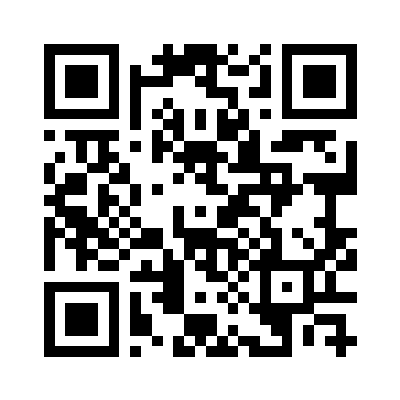

# 📶 Guest Wi-Fi at Resilience Gymnastics Academy

Welcome to Resilience Gymnastics Academy! Complimentary Wi-Fi is available for parents, guests, and visitors.

---

   
  <strong>📷 Scan with your phone's camera to join instantly</strong>

---

### **Network Name (SSID):**
> ## **RGA Guest WiFi**

### **Password:**
> **None** *(Open Network with Portal Login)*

---

### **How to Connect:**

1. **Scan or Select:** Scan the QR code above or select **RGA Guest WiFi** in your device's Wi-Fi settings.
2. **Open Portal:** Wait for the welcome screen to pop up.  
   *(If the screen doesn't pop up automatically, open any browser and visit **neverssl.com** or **rgagymnast.com**).*
3. **Activate Access:** 
   - Enter your email address and tap **"Connect for Free"** for **60 minutes** of complimentary access.
   - **Have an Event / Day Pass?** Enter your pass code under **"Redeem Pass Coupon"** for high-speed access.

---

### **Quick Tips & Troubleshooting:**
- **Reconnecting:** When your 60-minute session expires, simply reconnect to **RGA Guest WiFi** and tap connect again.
- **Portal Not Loading?** Turn your device's Wi-Fi off and back on, or forget the network and reconnect.
- **Questions or Special Access?** Please check in with the front desk!

---
*Resilience Gymnastics Academy • 6180 East Warren Ave, Denver, CO • [rgagymnast.com](https://rgagymnast.com)*
